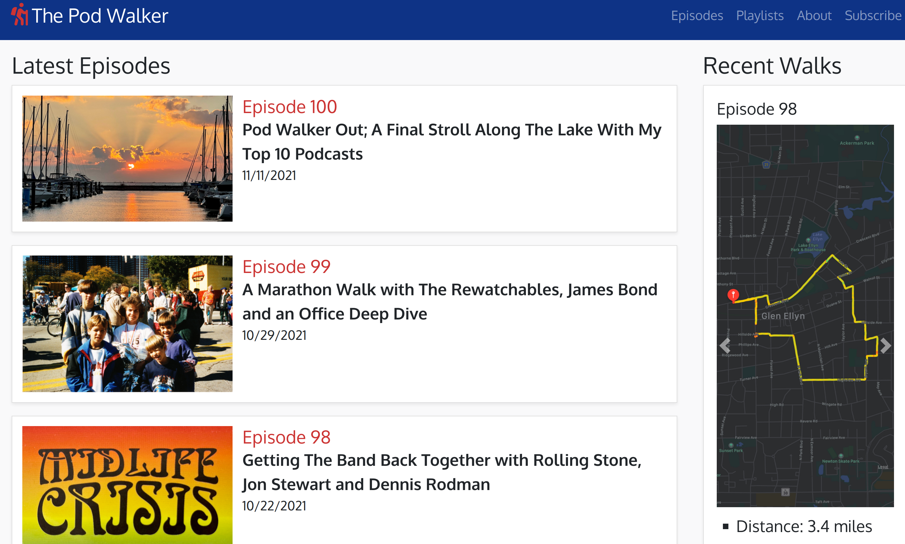
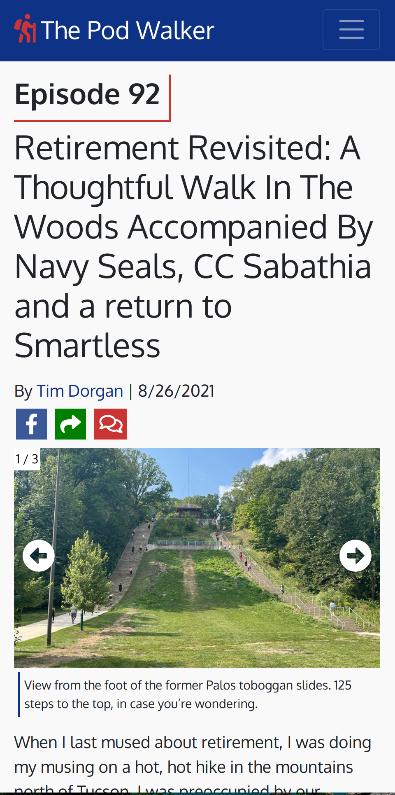

# thepodwalker.com

A blog chronicling long walks and interesting podcasts. 

- Backend: MongoDB - Express(.js) - Node(.js)
- Frontend: Bootstrap
- Templating: EJS
- Email Platform: SendGrid

Highlights
- 50+ real registered users
- Emails sent to each user after signup and new blog posts
- secured with reCAPTCHA v2
- AWS for photo storage
- Facebook sharing and commenting plugins for each post
- ListenNotes podcast playlists embedded in each post

# Desktop

   

# Mobile

